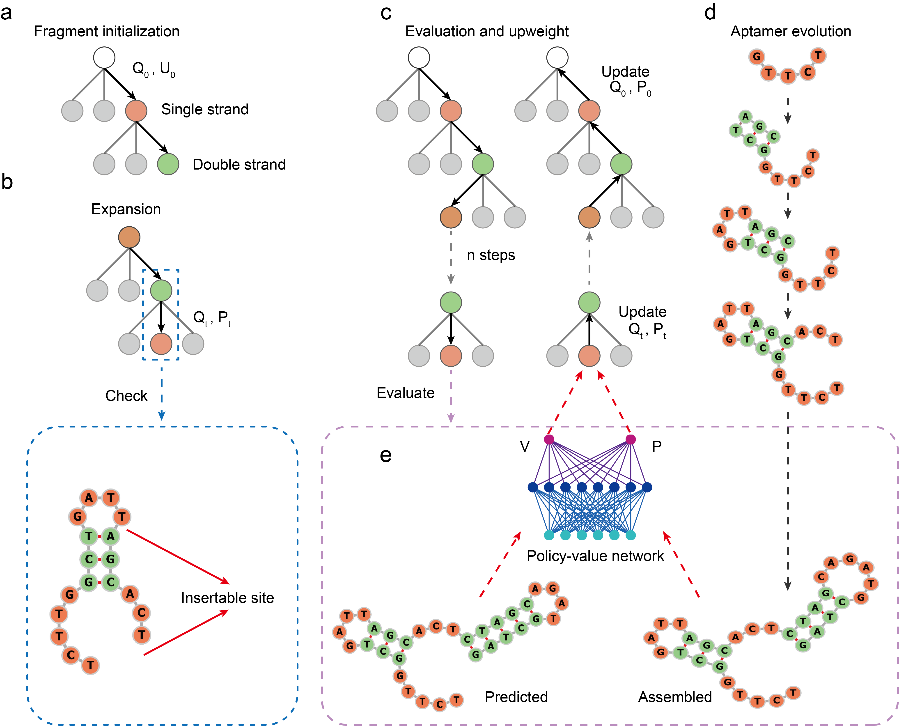

# AiDTA



## Overview
This project implements a policy-value network and a self-play pipeline for generating and training data for decision-making in a sequence-based task. The main components include a neural network architecture, a data collection pipeline, a Monte Carlo Tree Search (MCTS) implementation, and configuration settings.

## Code organization

### `cnn_net.py`
This file defines the core neural network architecture, including the policy-value network and its training logic. Key components include:


### `collect.py`
This file contains the logic for collecting self-play data to train the policy-value network. Key components include:


### `config.py`
Contains configuration settings for the project, including:


### `mcts.py`
This file implements the Monte Carlo Tree Search (MCTS) algorithm used for decision-making. Key components include:


### `game.py`
This file provides the core logic for sequence manipulation, state representation, and game evaluation. Key components include:


## How to Use

### Prerequisites
- Python 3.7 or higher
- Required libraries: `torch`, `numpy`, `pickle`

### Setup
1. Install the required Python libraries:
   ```bash
   pip install torch numpy
   ```
2. Ensure the necessary files (`cnn_net.py`, `collect.py`, `config.py`, `mcts.py`, `game.py`) are in the same directory.
3. Update the paths in `config.py` if necessary (e.g., model and data buffer paths).

### Running the Project

#### Construction of fragment pool
We first use 3D RNA/DNA to predict the 3D structures of single-stranded fragments of lengths 3-6 nt and double-stranded fragments of lengths 3-6 bp. Then, we use HDOCK to perform molecular docking of the fragments with the target protein. The fragments are selected based on their docking sites and scores. Once the sequence fragments and their secondary structures have been filtered, the filtered fragments and their corresponding secondary structures should be placed into `list1` and `list2` in the respective files (`game.py`, `mcts.py`, and `collect.py`). Here's an example of how these lists should look:

```python
# Fragment list
list1 = [
    'GGC&GCC', 'CGT&ACG', 'TAT&ATA', 'CAC&GTG', 'AAG&CTT', 'TACA&TGTA', 
    'ATCG&CGAT', 'AATA&TATT', 'TAAA&TTTA', 'GTGG&CCAC', 'GGGTG&CACCC', 
    'CCAGC&GCTGG', 'CGGTG&CACCG', 'AGGTG&CACCT', 'TCAGG&CCTGA', 
    'TAAATG&CATTTA', 'AAAAGG&CCTTTT', 'TAAAGG&CCTTTA', 'TAAGTG&CACTTA', 
    'TAAAGT&ACTTTA', 'AGG', 'CTG', 'GGG', 'GAA', 'GAC', 'GAGA', 'GCCA', 
    'ATTT', 'TCTG', 'GTTG', 'TTAGT', 'TTAGA', 'TTGGT', 'TTGGA', 'TTTGC', 
    'TTTTAA', 'TCTTTG', 'TTTTAC', 'TACGTC', 'TTCTGG'
]

# Structure of fragment
list2 = [
    '(((&)))', '(((&)))', '(((&)))', '(((&)))', '(((&)))', '((((&))))', 
    '((((&))))', '((((&))))', '((((&))))', '((((&))))', '(((((&)))))', 
    '(((((&)))))', '(((((&)))))', '(((((&)))))', '(((((&)))))', '((((((&))))))', 
    '((((((&))))))', '((((((&))))))', '((((((&))))))', '((((((&))))))', 
    '...', '...', '...', '...', '...', '....', '....', '....', '....', 
    '....', '.....', '.....', '.....', '.....', '.....', '......', '......', 
    '......', '......', '......'
]

```
### Inference
Use the `PolicyValueNet` class in `cnn_net.py` for making predictions on sequences and structures. For example:
```python
from cnn_net import PolicyValueNet

model = PolicyValueNet(model_file='current_policy.pkl')
sequence = 'AAACCCAAACCCCCCAAAAAA&GGG&GGGAAACCCCCC&GGG&GGG&GGGAAA'
structure = '...(((...((((((......&)))&)))...((((((&)))&)))&)))...'
act_probs, value = model.policy_value([sequence, structure])
print("Action Probabilities:", act_probs)
print("Value:", value)
```

#### Collect eligible sequences and train model
1. Ensure the `CollectPipeline` class in `collect.py` is correctly initialized with a valid model path (`current_policy.pkl`) or starts with a new model.
2. Run the script to begin the self-play and data collection pipeline:
   ```bash
   python collect.py
   ```
3. The pipeline will continuously collect self-play data and store it in a buffer for training.
4. Run the training script:
   ```bash
   python train.py
   ```


#### Output example:
```bash
TCTGTCTGGGCGACATTTGCCGTGGCCACCCAGCGAGAGCTGGGTGGCCAC ........(((((...)))))(((((((((((((....))))))))))))) ........(((.......)))(((())))(((((....)))))(((()))) 0.92
```

- **TCTGTCTGGGCGACATTTGCCGTGGCCACCCAGCGAGAGCTGGGTGGCCAC**: This is the **assembled sequence**, representing the nucleic acid sequence synthesized through some method (such as a deep learning model or biological experiment).

- **........(((((...)))))(((((((((((((....)))))))))))))**: This is the **predicted secondary structure**, representing the secondary structure of the nucleic acid sequence predicted by a computational model. The symbols like `(` and `)` represent double-helix structures and single-stranded regions.

- **........(((.......)))(((())))(((((....)))))(((())))**: This is the **assembled secondary structure**, representing the actual secondary structure obtained from the assembled sequence. This structure is derived from actual measurements or experimental methods.

- **0.92**: This is the **sequence similarity between the assembled structure and the predicted structure**, a numerical value that indicates the degree of similarity between the predicted secondary structure and the actual assembled structure. A value closer to 1 indicates higher similarity.


```
@article{Unpublished,
  title={Robust deep learning--based protein sequence design using ProteinMPNN},
  author={Gaoxing Guo, Xiaoming He, Jiaqiang Qian, Lei wang, Xizhou Qian and Qiang Huang},
  journal={Unpublished},
  year={2025},
  publisher={Unpublished}
}
```


